# 🧭 RateAtlas

**RateAtlas** is a modular tax intelligence platform that ingests, normalizes, and visualizes historical IRS data to help users understand how U.S. marginal tax rates evolve over time.

The platform is composed of multiple interconnected services — each designed to handle a specific stage of the data lifecycle: ingestion, computation, and visualization.

---

## 🚦 Quick Start

Spin up the full stack locally with the steps below. Each module has deeper instructions in its own README, but this flow gets you from clone → data → API → UI.

### Prerequisites

| Tooling | Minimum Version | Used By |
| ------- | ---------------- | ------- |
| Git | latest | Repository management |
| Python | 3.11 | `rateatlas-ingest` ingestion job |
| pip + venv | matching Python | Python deps & virtual env |
| Java | 17 | `rateatlas-api` Spring Boot service |
| Maven | 3.8 | API build/run (`./mvnw` ships in repo) |
| Node.js | 20+ | `rateatlas-frontend` Vite app |
| npm | 10+ | Frontend dependencies & scripts |
| Docker + Compose | Latest engine | Local Postgres + API container |
| AWS credentials | Optional for local dry run, required for real S3 writes | Ingest + API import jobs |

### Steps

1. **Clone the repo**

   ```bash
   git clone https://github.com/CHA0sTIG3R/RateAtlas.git
   cd RateAtlas
   ```

2. **Ingestion (BracketForge) setup**

   ```bash
   cd rateatlas-ingest
   python3 -m venv .venv && source .venv/bin/activate
   pip install -r requirements-dev.txt
   ```

   Create `.env` with at least:

   ```ini
   S3_BUCKET=rateatlas-dev
   S3_KEY=history.csv
   DRY_RUN=1
   ENABLE_BACKEND_PUSH=0
   BACKEND_URL=http://localhost:8080
   ```

   Then fetch and normalize the latest IRS data (dry-run mode avoids touching AWS):

   ```bash
   python -m tax_bracket_ingest.run_ingest
   ```

3. **API (TaxIQ) with Postgres**

   ```bash
   cd ../rateatlas-api
   cp .env.example .env.local
   docker compose -f docker-compose.yml -f docker-compose.local.yml up -d --build
   ./mvnw spring-boot:run
   ```

   Swagger UI will be live at <http://localhost:8080/swagger-ui/index.html>.
4. **Frontend (TaxLens)**

   ```bash
   cd ../rateatlas-frontend
   npm install
   echo "RATE_ATLAS_API_BASE_URL=http://localhost:8080/api/v1" > .env.local
   npm run dev
   ```

   Vite serves on <http://localhost:5173> and proxies `/api` to the backend automatically (see `vite.config.ts`).

### Verify Everything

- Run the ingest script again with `DRY_RUN=0` once you connect it to real AWS S3 + backend credentials.
- Hit `GET /api/v1/tax/years` in Swagger to confirm data landed.
- Load the frontend dashboard and run a calculation to confirm API connectivity.

---

---

## 🧩 Architecture Overview

```mermaid
graph TD
  A["🏗️ BracketForge<br/>(rateatlas-ingest)"] -->|Ingested & Normalized Tax Data| B["🧮 TaxIQ<br/>(rateatlas-api)"]
  B -->|API Responses & JSON Data| C["📊 TaxLens<br/>(rateatlas-frontend)"]
  B --> D["(💾 TaxGrid<br/>Database)"]
  subgraph AWS Cloud
    A
    B
    D
  end
  subgraph Client Side
    C
  end
```



---

## 📦 Core Modules

### 🏗️ [**rateatlas-ingest**](./rateatlas-ingest/README.md)

**Codename:** *BracketForge*
A Python-based ingestion engine that automatically scrapes, cleans, and normalizes IRS historical tax bracket data.

- Pulls official IRS tables across multiple years
- Standardizes columns and schema for consistent storage
- Outputs versioned datasets to AWS S3 for downstream use

---

### 🧮 [**rateatlas-api**](./rateatlas-api/README.md)

**Codename:** *TaxIQ*
A Spring Boot backend that exposes endpoints for tax calculations, trend analysis, and marginal rate lookups.

- Computes marginal, average, and effective tax rates
- Integrates with RateAtlas data from BracketForge
- JSON logging with environment-based log level control
- Deployed on AWS (ECS or EC2) with CloudWatch integration

---

### 📊 [**rateatlas-frontend**](./rateatlas-frontend/README.md)

**Codename:** *TaxLens*
A modern React + TypeScript + Vite interface for interactive exploration of U.S. tax history.

- Visualizes rate trends and bracket thresholds over time
- Offers side-by-side year comparisons
- Built with Tailwind CSS and Recharts for responsive design

---

### 💾 **TaxGrid (Data Layer)**

Internal PostgreSQL / S3 storage architecture that supports versioned data retrieval and analysis.

- Central schema for normalized IRS data
- Supports both local and AWS RDS setups
- Used by API and analytics scripts for querying and caching

---

## 🔍 Data Flow

1. **BracketForge** (`rateatlas-ingest`) scrapes the IRS HTML tables, normalizes each filing status into a canonical CSV, and (when not in dry-run) appends the new year into the historical `history.csv` stored in S3.
2. Optional: the same run can push the fresh CSV to **TaxIQ** via `POST /api/v1/tax/upload` when `ENABLE_BACKEND_PUSH=1` and `BACKEND_URL` is configured.
3. **TaxIQ** (`rateatlas-api`) persists ingested data into Postgres via Spring Data JPA. On startup it can bootstrap from the same S3 history file using the `data-import` profile or the scheduled S3 import.
4. **TaxLens** (`rateatlas-frontend`) calls the API for `/tax/history`, `/tax/breakdown`, and related endpoints to render charts, calculators, and comparisons in the browser.

This flow keeps S3 as the “source of truth” archive, the API/DB as the serving layer, and the frontend as the visualization surface.

---

## ⚙️ Configuration Reference

| Component | Key Variables | Purpose / Notes | Defined In |
| --------- | ------------- | --------------- | ---------- |
| Ingestion (`rateatlas-ingest`) | `S3_BUCKET`, `S3_KEY` | Location of `history.csv` in S3; required even for dry-run | `.env`, `tax_bracket_ingest/run_ingest.py` |
|  | `DRY_RUN`, `ENABLE_BACKEND_PUSH` | Toggle writes to S3/backends | `.env` |
|  | `BACKEND_URL`, `INGEST_API_KEY` | Optional push to `POST /api/v1/tax/upload` | `.env` |
|  | `AWS_REGION`, AWS credentials | Needed when accessing S3 without instance roles/OIDC | `.env` |
| API (`rateatlas-api`) | `SPRING_DATASOURCE_URL`, `SPRING_DATASOURCE_USERNAME`, `SPRING_DATASOURCE_PASSWORD` | Database connection overrides | `.env.local`, `application.properties` |
|  | `APP_INGEST_API_KEY` | Protects ingest endpoint | `.env.local` |
|  | `TAX_S3_BUCKET`, `TAX_S3_KEY`, `TAX_S3_IMPORT_ENABLED`, `TAX_S3_IMPORT_CRON` | Controls scheduled S3 sync | `.env.local`, `application.properties` |
| Frontend (`rateatlas-frontend`) | `RATE_ATLAS_API_BASE_URL` or `VITE_API_BASE_URL` | Base URL for Axios client (see `src/api.ts`) | `.env.local`, `vite.config.ts` |
| Shared | `AWS_REGION` | Used by both Python ingestion and Java API when touching AWS | respective `.env` files |

Keep production secrets in your deployment systems (GitHub Actions secrets, AWS Parameter Store, etc.) and never commit `.env` files.

---

## ☁️ Deployment & Infrastructure

| Environment     | Description                                            |
| --------------- | ------------------------------------------------------ |
| **Development** | Docker Compose setup for local ingestion + API testing |
| **Production**  | AWS-based stack (ECR, ECS, Lambda, RDS, CloudWatch)    |
| **CI/CD**       | GitHub Actions for build, test, and deploy pipelines   |
| **Logging**     | ECS-formatted JSON logs with dynamic log levels        |

---

## 🧠 Future Roadmap

- [ ] Add inflation-adjusted rate comparisons
- [ ] Support state-level tax data
- [ ] Integrate interactive “what-if” calculators
- [ ] Enable public API documentation (Swagger / Redoc)
- [ ] Host frontend at [**ratesatlas.com**](https://ratesatlas.com)

---

## 🧾 Example Use Case

> “How has the top marginal tax rate changed from 1980 to 2025?”

1. **BracketForge** ingests IRS source data for both years.
2. **TaxIQ** computes the marginal rate differences.
3. **TaxLens** visualizes the comparison graphically.

Result: users get a historical perspective and effective tax visualization in seconds.

---

## 🧰 Tech Stack Summary

| Layer      | Technology                                         |
| ---------- | -------------------------------------------------- |
| Ingestion  | Python 3.11, Pandas, AWS SDK (Boto3), Pytest       |
| API        | Java 17, Spring Boot 3, Maven, ECS logging         |
| Frontend   | React 18, TypeScript, Vite, Tailwind CSS, Recharts |
| Infra      | AWS ECR / ECS / Lambda / S3 / CloudWatch / RDS     |
| Testing    | Pytest, JUnit, GitHub Actions CI                   |
| Deployment | Docker multi-stage builds, AWS ECR images          |

---

## 💡 About

**RateAtlas** was created by [Hamzat Olowu](https://github.com/CHA0sTIG3R) as a full-stack data platform exploring the evolution of U.S. marginal tax rates.
It aims to make tax data more transparent, comparable, and visually intuitive for developers, analysts, and policymakers.

---

### 🗺️ Ecosystem Layout

```txt
RateAtlas/
├── rateatlas-ingest/        # BracketForge - IRS ingestion pipeline (Python)
├── rateatlas-api/           # TaxIQ - Spring Boot backend API
├── rateatlas-frontend/      # TaxLens - React frontend
└── README.md                # Umbrella documentation
```

---

### 🔗 Links

- **Website:** [https://ratesatlas.com](https://ratesatlas.com)
- **Docs:** Coming soon (`docs.ratesatlas.com`)
- **API Demo:** Coming soon (`api.ratesatlas.com`)
- **Author:** [@CHA0sTIG3R](https://github.com/CHA0sTIG3R)

---

## 🧪 Testing & CI

| Layer | Local Command | Notes |
| ----- | ------------- | ----- |
| Ingestion | `pytest` (or `pytest -m "not integration"` / `pytest -m integration`) | Requires Python venv, hits live network for integration tests |
| API | `./mvnw test` | Spins up Testcontainers Postgres; ensure Docker is running |
| Frontend | `npm run lint` / `npm run build` | Uses Vite + ESLint |

GitHub Actions pipelines (see each repo directory) run these commands on push, enforce coverage (ingestion), build container images (API), and will later orchestrate frontend deploys. Align local checks with CI for smoother PRs.

---

## 🛠 Operations & Monitoring

- **Scheduling ingestion:** Use cron for self-hosted runs or AWS EventBridge / Lambda when inside AWS (see `rateatlas-ingest/README.md` for templates). Ensure `DRY_RUN=0` and valid AWS credentials when running for real.
- **API health:** Spring Boot Actuator exposes `/actuator/health`, `/metrics`, and `/info`; Swagger UI lives at `/swagger-ui/index.html` for manual endpoint checks.
- **Logging:** Ingestion logs to stdout/file path defined in `.env`; API logs JSON with correlation IDs suitable for CloudWatch (`logging.pattern.level` in `application.properties`); frontend uses Vite console logging during dev.
- **Deployment targets:** Production runs on AWS (ECR, ECS or Lambda, RDS, CloudWatch). Local Docker Compose (`rateatlas-api/docker-compose.local.yml`) mirrors that stack with Postgres and the API container.

---

## 📄 Licensing

- **rateatlas-api:** Apache License 2.0 (`rateatlas-api/LICENSE`)
- **rateatlas-ingest & rateatlas-frontend:** License to be finalized (currently unlicensed placeholders in their READMEs)

Until a unified license is published at the repo root, treat each module individually and avoid redistributing unlicensed components.

---

> *“Mapping how rates change — because understanding the past helps design a smarter tax future.”*
